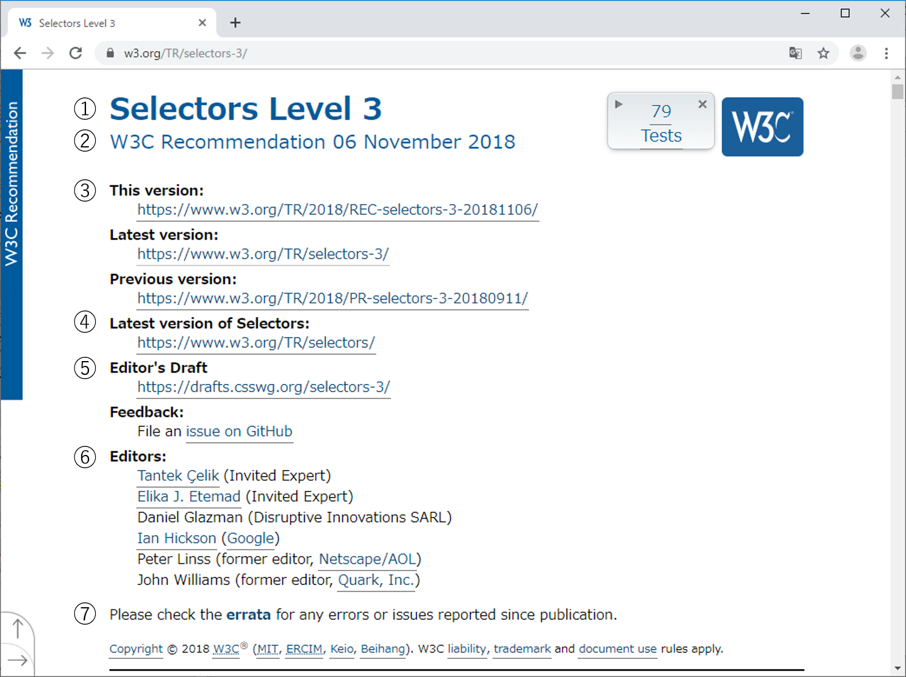

<!-- 1-6 各種仕様書のありかと読み方、仕様にアクセスするために必要な知識 ※仕様の内容を理解するために必要な知識は次章で扱う -->
<!-- 8ページ検討 6200～9400字 -->

# ウェブ仕様を読む
ウェブ技術に関する仕様書は、難解でわかりにくいイメージがあるかもしれません。ここでは、HTML仕様に限らず、ウェブに関する仕様書を読むためのヒントを提供したいと思います。

## わからないことをどのように調べるべきか
読者の皆さんはHTMLに限らず、ウェブ技術に関して何かわからないことがあれば、どのようにして解決するでしょうか。そのわからないことに関して、どの程度の詳しいことを知りたいのかにもよるでしょうが、例えば、あるHTML属性について属性の取ることができる値をウェブで調べたいとしましょう。

最初に思いつく方法としては、検索エンジンに知りたい項目をそのまま打ち込んで、一番上に来たページをとりあえず開いてみる、というものでしょうか。しかし、その検索結果の返す一番上のウェブページがどの程度信頼できるのか、という疑問は常について回ります。

次に思いつく方法としては、MDN Web Docs（以下、MDNとします）を調べてみるという方法でしょうか。MDNは英語版と、日本語を含む各国語に翻訳された版があります。記事によってばらつきはありますが、中立的な情報がまとまって記載されており、実際に役立つシーンが多々あります。しかし、翻訳である日本語版だけでなく、ときには原文である英語版も内容が古いということが少なくない頻度であります。ある程度は記事の最終更新日に注意を払うことで古い情報かどうかを判断できますが、更新日が最近だからといって、記事の内容がすべて最新の情報に更新されているという保証はありません。

最後に思いつく方法としては、HTMLの仕様書に当たる方法です。これは、最終的に行き着く先と言えます。本書はこのHTML仕様書にたどり着くことを大きな目標の1つとしています。特にHTML標準に限っては、常に最新の情報であるので、内容が古いことは原理的にはありません。よって、前述のMDNのような問題に悩まされることはありません。

また、HTMLに限らず、仕様書はウェブ技術の大元になる文書です。仕様書を参照してウェブブラウザーなどの実装は作られます（逆に、ウェブブラウザーの動作をもとに、仕様書の文言を作ることもあります）。

## 仕様書はなぜ読めないのか？
前節で、最終的に行き着く先は仕様書であると述べました。しかしながら、心理的なハードルの高さを感じて手を付けられずにいる、という人もいるかもしれません。この節では、前もって準備することで、可能な限りそのハードルを低くすることを目的に話を進めていきます。

仕様書固有の話題に入る前に一般的な話をしておきますと、文書の最初から最後まで通読する必要は必ずしもありませんし、お目当ての項目がある特定のセクションの全部も読む必要はありません。前節の例でいうなら、属性の値が何を持てるのかさえわかればよく、例えるなら辞書のように、必要なものを必要なだけピックアップして読めばいいわけです。もちろん、時間に余裕があるという人は通しで読むのにチャレンジしてみてもよいでしょう。

さて、考えられる仕様書固有な「読めない」原因については、次のものが挙げられます。

- どこに仕様があるのかわからない
- そもそも英語で書かれている
- 仕様書の流儀が分からない

以下でこの3つについて説明していきます。

## 仕様はどこにあるのか
ウェブページを構成する主要な技術として、HTML、CSS、JavaScriptという3つのものが核となることは概ね同意が得られるところだと思います。HTMLはWHATWG、CSSはW3C、JavaScriptはECMA Internationalと、各技術はそれぞれ別々の標準化団体により標準化が進められています。

なぜウェブページという1つのまとまったものにもかかわらず、核となる技術が別々の標準化団体によって仕様が発行されているのかという疑問を持つ読者の方もいるかもしれません。これは、端的に言えばそれぞれの標準化団体が扱う技術の範囲が異なるためです。語弊があるかもしれませんが、各標準化団体が縄張りとする技術の範囲があると言えます。

ところで一般に、ウェブに限らずインターネットに関する仕様書は、ウェブ上に無料で公開されており、各標準化団体のウェブページで公開されています。これはISOやJISのような伝統的な標準化団体によって発行される標準が、基本的に紙の仕様書として、有料で販売されているのとは対照的です。

ちなみに、WHATWGが公開しているHTML標準は次のURLにあります。

https://html.spec.whatwg.org/multipage/

WHATWGによるLiving Standardは、常に更新され続ける標準です。これは、多くの他の標準化団体が発行する仕様が最終版で固定されるのとは対照的であり、WHATWGの大きな特徴です。
<!-- この段落は必要か？ -->

## そもそも英語で書かれている
仕様書は多分に漏れず、英語で書かれています。必ずしも英語が得意というわけではないという人が読者の中にもいることでしょう。しかし、ありがたいことに、ウェブ仕様においては有志が参考日本語訳を公開していることがあります。HTML標準の場合は、次のURLから参考日本語訳をたどることができます。

https://github.com/whatwg/html/wiki/Translations

正式な仕様は英語版であって、日本語訳はあくまで参考に過ぎないことに注意してください。有志による翻訳が存在しない仕様の場合、機械翻訳を駆使するなどして読むことが求められます。

また、たとえ有志による日本語訳があったとしても、やはり英語版が正式な仕様であることに変わりはありません。仕様に書かれている正確なニュアンスを掴むために、有志の翻訳に頼ることなしに、辞書などを使いながら自力で読むことがあるかもしれません。

## 仕様書の流儀について
必要な箇所を必要なだけ読むに当たって、情報を絞り込むためのヒントや、必要な情報を素早く見つける手がかりを抑えておくとよいポイントをいくつか示してみます。

### HTML仕様の記述
まずはHTML仕様の1章にある、「仕様の読み方」に関する記述を当たってみましょう（引用は日本語訳によります）。

> この仕様は、他の仕様同様に読むべきである。まず、表紙から終わりまで複数回読むべきである。そして、少なくとも1回は後ろから読むべきである。それからコンテンツのリストからランダムに章を選び、すべての相互参照をたどって読むべきである。
>
> 下記の適合性要件の章で説明されるように、この仕様は、適合性の様々なクラスの適合基準を記述している。具体的には、たとえば著者および著者が作成した文書といったプロデューサーに適用される適合性の要件と、たとえばウェブブラウザーといった、コンシューマーに適用される適合性要件がある。これらは、必要としているものによって区別することができる。プロデューサーに対する要件は許可されるものを記載し、一方でコンシューマーに対する要件はどのようにソフトウェアが動作するかを記載する。

時間を掛けて仕様全体をくまなく読むという行為は、HTML仕様そのものが巨大と言うこともあり、なかなか難しいでしょう。ただし、相互参照つまりリンクをたどって読むのは必要に応じて行うとよいでしょう。これは、Wikipediaのある項目のリンクをたどっていくと、いつの間にか最初に調べた項目の周辺知識まで手に入れてた、というような効果を得ることができるためです。

やや話がそれましたが、属性値の例で言うと、1つの箇所にすべての知りたい情報があるとは限らないという側面もあります。必要とする情報が仕様書のどこにあるのかという勘所をつかむという視点で、読み方を工夫するとよいでしょう。

ところで、ウェブ制作者向けの記述と、ブラウザー実装者向けの記述が分けられている、という点は注目に値します。つまりウェブ制作者は、ブラウザーに関する細かい挙動について常に把握する必要はないので、ブラウザー向けの記述を無視できると言えます。実際、HTML標準に限って言えば、Developer's Editionというウェブ開発者向けのバージョンが用意されており、このバージョンを参照することで、情報量を減らすことができます。

HTML Standard, Developer's Edition 

https://html.spec.whatwg.org/dev/

### 規範部分と参考部分
ウェブ仕様は一般に、規範（normative）な箇所と参考（infomativeまたはnon-normative）な部分にわけることができます。仕様の規範部分のみが仕様の規則であり、参考部分は規範部分を理解するための参考情報にすぎません。従って、仮に規範部分と参考部分に食い違いがある場合、規範部分が優先されます。

一般に、本文は特に断りがない限り、規範部分となります。また参考部分は、例と注、図が挙げられます。WHATWGでは、Infra標準に次のように明示されています。

>All assertions, diagrams, examples, and notes are non-normative, as are all sections explicitly marked non-normative. Everything else is normative.

興味深いことに、WHATWGでは、各標準に出現する基盤となる共通部分を1つの標準にまとめてしまっています。Infra（インフラ）という言葉のとおりです。

### RFC 2119キーワード
仕様は一般に、IETFが発行するRFC 2119と呼ばれる文書で定義されるキーワードで適合性の要件が指示されます。ウェブ仕様でRFC 2119キーワードが使用されることを示す典型的な文は次のとおりです。

>The keywords "MUST", "MUST NOT", "REQUIRED", "SHALL", "SHALL NOT", "SHOULD", "SHOULD NOT", "RECOMMENDED", "NOT RECOMMENDED", "MAY", and "OPTIONAL" are to be interpreted as described in RFC 2119. [RFC2119]

RFC 2119は、RFC 8174で更新されていますが、IETF以外が策定する仕様では、読みやすさのためにキーワードは小文字で出現し、もっぱらRFC 2119にのみ従います。

ウェブ標準で頻出するRFC 2119キーワードと典型的な日本語訳、およびキーワードの持つ意味は表のようになります。

表 1-6-1 RFC 2119キーワードと日本語の対応

|キーワード|典型的な日本語訳|意味|
|----|----|----|
|must|～しなければならない|必須|
|should|～すべきである|推奨|
|recommend|～推奨される|推奨|
|may|～してもよい|許容| 
|should not|～すべきではない|緩い禁止|
|must not|～してはならない|禁止|

多くの場合、RFC 2119キーワードの全部が出現することはありません。特に、mustとshallはRFC 2119において同じ「必須」であることを示すとされており、前者のみを用いることがほとんどです。そのため、表ではshallを省略しています。ところでまったくの余談ですが、英語圏の法律や契約文書においては、単語shallを普通用い、mustを使用しません。ISO標準もshallを用います。[^1]

[^1]: ISO標準は、ISO/IEC Directives, Part 2という文書で細かな規定がされています。

また、RFC 2119において、shouldとrecommendは同じ意味を表すキーワードです。意味について解説しますと、必須および禁止とは、必ず守らなければならない事項です。この要求事項を守れなかった場合、仕様に違反することになります。推奨とは、指示に従わない特別な理由がなければ、指示通りにすることが求められる事項です。許可とは、オプションであり、してもしなくてもよい事項です。

例を1つ示してみましょう。`meta`要素には`charset`という属性があります。この属性値についてHTML 5.0では、
> Authors should use UTF-8.
<!-- https://www.w3.org/TR/html50/document-metadata.html#charset -->

「著者は、UTF-8を使用すべきである。」とされていました。つまり、何か理由があればUTF-8以外でもよかったわけです。一方、HTML Standardでは、

> If the attribute is present, its value must be an ASCII case-insensitive match for the string "utf-8".
<!-- https://html.spec.whatwg.org/multipage/semantics.html#the-meta-element -->

「この属性が存在する場合、その値は"utf-8"（中略）でなければならない。」とされています。つまり、HTML仕様に則ったHTMLであるためには、例外なく常にUTF-8でなければならないことを意味します。

### 仕様書表紙の構成要素
ここで、HTMLから話は少しそれますが、典型的な仕様書の例としてW3Cの仕様書を取り上げ、どのような情報が書かれているかを見てみましょう。

図 1-6-1 あるW3C仕様書の表紙部分のスクリーンショット

図中の番号①～⑦を順を追って説明します。

- ①は仕様の名前です。
- ②は仕様のステータスと、発行された日付です。W3C仕様のステータスの位置付けについては、1-4節を参照してください。またステータスについては、ウィンドウ左上の帯にも常に表示されており、図では“W3C Recommendation”と縦書きで表示されている箇所になります。
- ③はこのバージョンの仕様書のURLです。バージョンを固定したい場合に使用できます。なお、W3Cの場合、<https://www.w3.org/TR/>がW3Cの正式な手続きに則った仕様書のURLです。パス`TR`の次のパスに示される4桁の数字が発行された年であり、最後のハイフン区切りになっているパスが、左から仕様のステータスの略称、仕様の短縮名、発行年月日を表しています。
- ④は最新の仕様のURLです（このURLが書かれていないものもあります）。リンク先が後続の仕様であることがあります。つまり言い換えると、閲覧している仕様書が最新の仕様書でないことがあり得る、ということになります（Living Standardはそういったことはありません）。
- ⑤は編集者草案のURLです。編集者が変更しているスナップショットのバージョンを見ることができます（ある意味で、Living Standardに近しい存在と言えます）。
- ⑥は編集者の一覧です。仕様のメンテナンスをしている人です。この仕様に関するキーパーソンであると言え、仕様の策定に関してさらに詳しいことを調べる場合に有用な情報です。
- ⑦はエラッタ（正誤表）へのリンクです。特に勧告となった後に誤りが報告された場合に、リンク先にその修正内容が記載されることがあります。

W3Cの仕様書に限らず、仕様書一般の注意事項として、最新の文書を参照できているのか、言い換えると、今見ているページよりも新しい文書が存在するにもかかわらず、そうとは知らずに古くなっている文書を参照していないかどうかについて注意を払う必要があります。もちろん、より新しい作業草案があることを知った上で、必要に迫られて古い勧告を参照する場合はこの限りではありません。

図の例では、②や④に注意を払うことにより、閲覧している文書が最新の文書をなのかどうかを確認することができます。実際、執筆時点で④をクリックすると、Selector Level 4[^2]という文書を参照することができ、より新しい仕様の草案があることが確認できます。

[^2]: https://www.w3.org/TR/selectors-4/

### 索引
仕様書によりますが、索引が用意されていることがあります。もちろんHTML仕様には索引のページが存在し、前述の例で言うと、調べたい属性をページ内検索で検索してしまえばよいことになります。

図 1-6-2 HTML仕様の索引（属性）のスクリーンショット