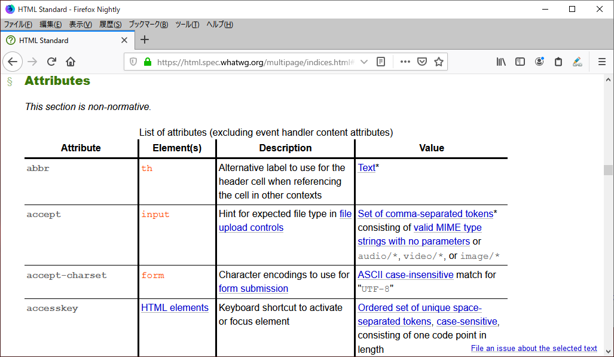

# ウェブ仕様を読む

ここまで説明してきたように、HTMLの仕様はさまざまな歴史を経て発展してきました。
現在のHTMLの仕様を確認するにはどうすれば良いでしょうか。ここでは、HTML仕様をはじめとした、ウェブに関する仕様書を読むためのヒントを提供したいと思います。

## 仕様はどこにあるのか

WHATWGが公開しているHTML標準は、ウェブで公開されており、以下のURLで読むことができます。

<https://html.spec.whatwg.org/multipage/>

URLに"multipage"と含まれているのは、複数ページ版 (multipage version) を意味しています。URLから`/multipage/`を削除すると単一ページ版になりますが、これは膨大な内容のすべてを1つのページに収めたものであり、読み込みに長い時間がかかります。通常は複数ページ版を参照するとよいでしょう。最初から最後まで通しで印刷したい、ダウンロードしておいてオフラインで参照したいという場合には単一ページ版が便利です。

また、コンテンツ制作者向けとして、ブラウザベンダー向けの情報 (レンダリングルールなど) を省いたバージョンがHTML Standard, Developer's Editionとして存在しています。

<https://html.spec.whatwg.org/dev/>

URLに注目すると、いずれも日付やバージョン番号が含まれていないことがわかります。WHATWGによるLiving Standardは、常に更新され続ける標準です。これは、WHATWGが管理する標準の大きな特徴であり、他の多くの標準化団体が発行する仕様が最終版で固定されるのとは対照的です。

### 仕様の言語と日本語版

ほとんどのウェブ仕様と同じく、HTMLの仕様書も英語で書かれています。

ウェブ仕様は無料で公開されていますが、翻訳が許可されているライセンスであることが珍しくありません。そこで、日本語で読みたいという人のために、有志が参考となる日本語訳を公開していることもあります。HTML Standardの場合は、次のURLから日本語訳をたどることができます。

<https://github.com/whatwg/html/wiki/Translations>

ただし正式な仕様は英語版であり、日本語訳はあくまで参考に過ぎないことに注意してください。

また、機械翻訳を駆使して読む方法もあります。いずれにせよ、英語版が正式な仕様であることに変わりはありません。仕様に書かれている正確なニュアンスを掴むためには、翻訳に頼ることなしに、辞書などを使いながら自力で読む必要があるかもしれません。

筆者のおすすめは、日本語訳があればまずそれを読んでみて、意味がよくわからないところは原文に当たるという方法です。日本語では表現の難しい言葉や概念もあり、あらためて原文で読むと理解できる場合がしばしばあります。訳者によっては、日本語訳のフィードバックを受け付けていることがあります。そのような場合にフィードバックを送ることで、日本語訳の品質向上に貢献するとよいでしょう。

## HTML仕様の読み方

それでは実際に仕様を読むに当たって、どのような読み方をすればよいでしょうか。
HTML仕様の1章には、"How to read this specification"というズバリそのものなセクションがあります[^1]。

[^1]: https://html.spec.whatwg.org/multipage/introduction.html#how-to-read-this-specification

ここでは以下のようなことが書かれています。

- 仕様は最初から最後まで複数回通読すべきであり、また少なくとも一回は逆から読んだ方がよい
- 目次から任意の章を選んで読んだり、そこからリンクを辿って他の章の内容を読むこともできる

“逆から読んだ方がよい”というのは半ば冗談でしょうが、仕様は基本的に、前から順に通読できるように書かれています。とはいえHTML仕様そのものが巨大と言うこともあり、通読はなかなか難しいというのが現状でしょう。

なお、WHATWG標準の共通ルールは"Infra"という文書にまとめられています (「Infra標準」とも呼びます)[^2]。用語の使い方や記述ルールはこちらを参照する必要があります。

[^2]: https://infra.spec.whatwg.org/

### 目次から探す

多くの場合は、目次から必要な箇所だけを探して読むという使い方になるでしょう。仕様書の表紙ページには目次があり、見たい章に飛ぶことができます。
とはいえ、初見ではどの章に何が書かれているのかわからないことも多いでしょう。以下に、よくありそうな用途と、その情報が執筆時点でどの章に書かれているかを簡単に紹介します。

#### HTMLの要素について詳しく知りたい

これが最も多いニーズだと思います。HTMLの要素については4章に書かれています。

- 4 The elements of HTML

本書でも要素の解説はしていますが、厳密な定義が知りたい時は適宜こちらを参照してください。

#### HTMLの文法について詳しく知りたい

HTMLの文法(シンタックス)については、12章に記載があります。不正なHTMLがどう解釈されるか、といった情報も書かれています。

- 12 The HTML syntax

ただし、HTMLを解析するパーサーの実装者向けに書かれている箇所については、コンテンツ制作者にとってはやや難解かもしれません。プログラミングができる方は、試しにパーサーを自分で実装してみるとこの章の理解が進むでしょう。

#### JavaScriptと連携する機能の情報が知りたい

6章にはインタラクションに関する属性の情報があります。その他、7章から11章にかけて各種のAPIの情報が書かれています。

- 6 User interaction
- 7 Loading Web pages
- 8 Web application APIs
- 9 Communication
- 10 Web workers
- 11 Web storage

#### 古いHTMLとの互換性について知りたい

過去のHTMLにはあったものの、現在では廃止された機能については、15章に書かれています。

- 15 Obsolete features

新しくコンテンツを制作する際には必要ありませんが、古いHTML仕様に基づいて書かれたHTMLを触れるようなときに、当時のHTML仕様にあったものが現在どういう扱いかを知りたいことがあるかもしれません。そのような場合に参照するとよいでしょう。

### 索引から探す

HTML仕様には索引のページも存在します。目当ての要素や属性についてポンポイントで調べたい場合は、索引にアクセスしてページ内検索で検索してしまうのも手です。

図 1-6-2 HTML仕様の索引（属性）のスクリーンショット

## 仕様を読む上で注意が必要な点

実際に仕様を読むにあたり、慣れないと混乱しやすい点がいくつかあります。その注意点についていくつか紹介します。

### ブラウザベンダー向け情報が含まれている

前出の"How to read this specification"には、主にコンテンツ制作者 (プロデューサー) に向けた情報と、ブラウザベンダー (コンシューマー) に向けた情報の両方が含まれていることが記述されており、プロデューサーについての要件は、コンシューマーの要件と関係しないことが強調されています。

たとえば、仕様で`img`要素の`border`属性がどう定義されているのか調べるとすると、以下の2つの情報にたどり着きます。

- 3章では、現在の仕様にそのような属性は定義されていないように書かれている
- 15章の記述では、`border`属性が存在し、その特定の値を解釈する必要があると書かれている

前者がコンテンツ制作者向けの情報で、後者はブラウザベンダー向けの情報です。両者は矛盾しているように見えますが、無関係のものです。現在の仕様では、コンテンツ制作者は`border`属性を使うべきではありません。しかしブラウザーは、過去の互換性にも配慮する必要があるため、もし`border`属性があれば、その値を処理する必要があるのです。

ブラウザーベンダー向けの情報を見てコンテンツを作成してしまうことがないように注意しましょう。言い換えると、ブラウザーが解釈してくれるからといって、コンテンツ制作者向けの仕様を満たすわけではないと言えます。

### 規範部分と参考部分

仕様の見出しのすぐ下には、次のような文言が書かれていることがあります。

>This section is non-normative.

ウェブ仕様は一般に、規範（normative）とされる部分と、参考（infomativeまたはnon-normative）とされる部分にわけられます。規範部分のみが仕様の規則であり、参考部分は規範部分を理解するための参考情報にすぎません。従って、仮に規範部分と参考部分に食い違いがある場合、規範部分が優先されます。

一般に、参考部分には上に挙げたような注記がついており、参考であることがわかるようになっています。逆に、特に断りがない場合、本文は規範部分となります。ただし、本文に含まれる例と注、図は参考情報です。WHATWGでは、Infra標準に次のように明示されています。

>All assertions, diagrams, examples, and notes are non-normative, as are all sections explicitly marked non-normative. Everything else is normative.

### RFC 2119キーワード

仕様は一般に、IETFが発行するRFC 2119と呼ばれる文書で定義されるキーワードで適合性の要件が指示されます。ウェブ仕様でRFC 2119キーワードが使用されることを示す典型的な文は次のとおりです。

>The keywords "MUST", "MUST NOT", "REQUIRED", "SHALL", "SHALL NOT", "SHOULD", "SHOULD NOT", "RECOMMENDED", "NOT RECOMMENDED", "MAY", and "OPTIONAL" are to be interpreted as described in RFC 2119. [RFC2119]

RFC 2119は、RFC 8174で更新されていますが、IETF以外が策定する仕様では、読みやすさのためにキーワードは小文字で出現し、もっぱらRFC 2119にのみ従います。

ウェブ標準で頻出するRFC 2119キーワードと典型的な日本語訳、およびキーワードの持つ意味は表のようになります。

表 1-6-1 RFC 2119キーワードと日本語の対応

|キーワード|典型的な日本語訳|意味|
|----|----|----|
|must|～しなければならない|必須|
|should|～すべきである|推奨|
|recommend|～推奨される|推奨|
|may|～してもよい|許容|
|should not|～すべきではない|緩い禁止|
|must not|～してはならない|禁止|

多くの場合、RFC 2119キーワードの全部が出現することはありません。特に、mustとshallはRFC 2119において同じ“必須”であることを示すとされていますが、前者のみを用いることがほとんどです。そのため、表ではshallを省略しています。ところでまったくの余談ですが、英語圏の法律や契約文書においては、単語shallを普通用い、mustを使用しません。ISO標準もshallを用います。[^3]

[^3]: ISO標準は、ISO/IEC Directives, Part 2という文書で細かな規定がされています。

また、RFC 2119において、shouldとrecommendは同じ“推奨”の意味を表すキーワードです。こちらは“必須”と異なり、英語の表現上どちらも使用されます。

必須および禁止は、必ず守らなければならない事項です。この要求事項を守れなかった場合、仕様に違反することになります。推奨とは、指示に従わない特別な理由がなければ、指示通りにすることが求められる事項です。許可とは、オプションであり、してもしなくてもよい事項です。

例を1つ示してみましょう。`meta`要素には`charset`という属性があります。この属性値について、HTML 5.0では以下のように書かれています。

> Authors should use UTF-8.
<!-- https://www.w3.org/TR/html50/document-metadata.html#charset -->

“著者はUTF-8を使用すべきである”とされていました。この場合、何か理由があればUTF-8以外でもよいということになります。一方、HTML Standardでは、以下のように書かれています。

> If the attribute is present, its value must be an ASCII case-insensitive match for the string "utf-8".
<!-- https://html.spec.whatwg.org/multipage/semantics.html#the-meta-element -->

この属性が存在する場合、その値は"utf-8"でなければならない、とされています。この場合、HTML仕様に則ったHTMLであるためには、例外なく常にUTF-8でなければならないことを意味し、理由があるからと言ってUTF-8以外を使用することはできないということになります。

## HTML以外の仕様

ウェブページを制作する際には、HTMLだけでなく、CSSやJavaScriptの仕様を参照することもあるでしょう。すでに紹介したように、HTMLはWHATWGが仕様を策定していますが、CSSはW3C、JavaScriptはECMA Internationalと、各技術はそれぞれ別々の標準化団体によって策定されています。

一般に、ウェブに限らずインターネットに関する仕様書は、ウェブ上に無料で公開されており、各標準化団体のウェブページで公開されています。これはISOやJISのような伝統的な標準化団体によって発行される標準が、基本的に有料で紙の仕様書として販売されているのとは対照的です。

WHATWGの仕様と異なり、W3C等の仕様書は常に更新され続けるわけではなく、特定のバージョンが公開されています。また、過去の仕様もアーカイブとして残されているため、誤って古いものを見ていないか注意する必要があります。

ウェブ開発者がよく参照するのは、CSSの仕様などを策定しているW3Cの仕様書でしょう。例として、CSSの仕様書の一部をご紹介します。

図 1-6-1 あるW3C仕様書の表紙部分のスクリーンショット

これが最新の仕様かどうか、どのように確認すれば良いでしょうか。この表紙にはさまざまな情報があります。図中の番号①～⑦を順を追って説明します。

- ①は仕様の名前です。
- ②は仕様のステータスと、発行された日付です。W3C仕様のステータスの位置付けについては、1-4節を参照してください。またステータスについては、ウィンドウ左上の帯にも常に表示されており、図では“W3C Recommendation”と縦書きで表示されている箇所になります。
- ③はこのバージョンの仕様書のURLです。バージョンを固定したい場合に使用できます。なお、W3Cの場合、<https://www.w3.org/TR/>がW3Cの正式な手続きに則った仕様書のURLです。パス`TR`の次のパスに示される4桁の数字が発行された年であり、最後のハイフン区切りになっているパスが、左から仕様のステータスの略称、仕様の短縮名、発行年月日を表しています。
- ④は最新の仕様のURLです（このURLが書かれていないものもあります）。リンク先が後続の仕様であることがあります。つまり言い換えると、閲覧している仕様書が最新の仕様書でないことがあり得る、ということになります（Living Standardはそういったことはありません）。
- ⑤は編集者草案のURLです。編集者が変更しているスナップショットのバージョンを見ることができます（ある意味で、Living Standardに近しい存在と言えます）。
- ⑥は編集者の一覧です。仕様のメンテナンスをしている人です。この仕様に関するキーパーソンであると言え、仕様の策定に関してさらに詳しいことを調べる場合に有用な情報です。
- ⑦はエラッタ（正誤表）へのリンクです。特に勧告となった後に誤りが報告された場合に、リンク先にその修正内容が記載されることがあります。

図の例では、②や④に注意を払うことにより、閲覧している文書が最新の文書をなのかどうかを確認することができます。実際、執筆時点で④をクリックすると、Selector Level 4[^4]という文書を参照することができ、より新しい仕様の草案があることが確認できます。

[^4]: https://www.w3.org/TR/selectors-4/
