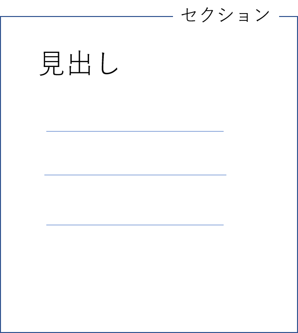

<!-- ch3-2.txt (4ページ、3000～4600字想定) -->
# セクション

この節では、節や項といったセクションを表現するアウトラインアルゴリズムの概念を説明し、それに関連する要素をご紹介します。

## セクションとアウトライン

一般に、文書には節や項といったセクションがあり、それぞれ節見出しや項見出しが存在します。セクションの冒頭には見出しがあり、見出しがセクション区切りの目印になっているとも言えるでしょう。

見出しやセクションは階層構造になっていることがあります。文書全体のタイトルがあり、その下に大見出しがあり、さらにその下に子見出しがある、というように、見出しには階層構造があるのが一般的です。このような見出しやセクションの階層の深さを「ランク」(rank) と呼びます。

長い文書の中から特定の箇所を拾い読みしたい場合、どこからどこまでが1つのセクションなのか、そのセクションがどのランクなのか、といった情報が重要になります。このような、文書のセクション構造全体を「アウトライン」(outline) と呼びます。

アウトラインの情報は、アクセシビリティの観点からも重要です。スクリーンリーダーの利用者は、多くの場合、まず見出しだけを順に読み上げ、文書全体の構造を理解してから必要なところを読むという使い方をします。

このため、WCAG 2.1 の達成基準2.4.6 "Headings and Labels"[^1]では、見出しを適切な文言にすることを求めています。また、2.4.10 "Section Headings"[^1]では、長い文書を複数のセクションに分割して見出しを追加することを推奨しています。

[^1]: https://www.w3.org/TR/2018/REC-WCAG21-20180605/#headings-and-labels
[^2]: https://www.w3.org/TR/2018/REC-WCAG21-20180605/#section-headings

## セクションの表現とアウトラインアルゴリズム

文書のアウトラインの情報は、スクリーンリーダーの利用者も含む、さまざまな利用者にとって必要なものです。これを機械的に処理できるようにするには、どうすればよいでしょうか。

HTMLでは、アウトラインの情報をマークアップによって表現することができます。その表現方法はいくつか用意されています。

ユーザエージェントは、HTMLのマークアップからアウトラインを読み取り、時には推測も交えて全体構造を構築します。ユーザーエージェントがアウトラインを構築する方法もルール化されており、「アウトラインアルゴリズム」(outline algorithm) と呼びます。

### 見出しによる暗黙のセクション

HTMLには「見出し」(heading) を表現する要素が用意されています。見出し要素は`h1`から`h6`まで6種類が用意されており、見出しを使い分けることで、セクションのランクを表現することができます。

見出しがきちんと使い分けされていれば、そこからセクションの構造を推測できます。ある見出しが出現してから、次に同ランクもしくはランクの高い見出しが出現するまでを、ひとつのセクションとみなすことができます。

このようにして自動的に生成されるセクションのことを「暗黙のセクション」(implied section) と呼びます。



図 3-2-01　見出しとセクションの関係

ただし、暗黙のセクションではうまく表現できないケースもあります。以下のマークアップでは、文の途中に注釈を挟み、注釈が終わったあとにまた文が続く構造を意図しています。

```html
<h1>見出し1</h1>
<p>最初の本文です</p>
<div class="note">
  <h2>注意</h2>
  <p>注意書きです</p>
</div>
<p>本文の続きです</p>
```

暗黙のセクションでは、各要素は最も近い見出しに所属するものとみなされます。そのため、最後の文は`h1`のランクではなく、`h2`のランクになります。つまり、本文ではなく注釈の一部と解釈される可能性があります。

注釈を`div`要素でマークアップしていますが、これはセマンティクス上の意味を持ちません。スタイルを工夫すれば、視覚的な見た目上は、最後の文が注釈でないように見せられるかもしれません。しかし意味的には、最後の文はあくまで注釈と同じ`h2`ランクのセクションに含まれることになります。

### セクショニングコンテンツによるセクションの明示

現在のHTML仕様では、セクションの範囲を明示するための要素が用意されています。先の例の場合、以下のように`section`要素を使うことで、最後の文が`h1`に所属することを明示できます。

```html
<h1>見出し1</h1>
<p>最初の本文です</p>
<section class="note">
  <h2>注意</h2>
  <p>注意書きです</p>
</section>
<p>本文の続きです</p>
```

このようにセクションを明示する機能を持つ要素は他にもあり、「セクショニングコンテンツ」(sectioning content) というカテゴリに分類されています。`article`、`section`、`aside`、`nav`の4つの要素が所属しています。4つの要素の使い分けについては後述します。

なお、最近よく使われるようになった`main`要素は、セクショニングコンテンツではありません。`main`要素は明示的なセクションを作らないため、見出し要素を`main`要素の直接の子要素にした場合、暗黙のセクションができることになります。

#### 入れ子によるランクの表現

セクショニングコンテンツを入れ子にして使えば、入れ子の深さでランクを表現できます。セクショニングコンテンツを入れ子にした場合、まず入れ子の深さでランクが判断され、見出し要素のランクよりも優先されます。

そうすると理論上、見出し要素の使い分けによるランクの表現は不要になります。先の例では`section`要素で階層構造を表現できているため、中の見出しを`h1`にすることもできます。

```html
<h1>見出し1</h1>
<p>最初の本文です</p>
<section class="note">
  <h1>注意</h1>
  <p>注意書きです</p>
</section>
<p>本文の続きです</p>
```

同じ`h1`要素が出現していますが、片方は`section`の中にあるため、1つ下のランクであると判断できます。HTMLのアウトラインアルゴリズムの上では、このようにしても、`h2`を使っていた時と同じアウトラインになります。

`section`要素を入れ子にしていけば、`h3`や`h4`に相当する階層も表現できます。

```html
<h1>見出し1</h1>
<p>見出し1の本文</p>
<section>
  <h1>見出し2</h1>
  <p>見出し2の本文</p>
  <section>
    <h1>見出し3</h1>
    <p>見出し3の本文</p>
    <section>
      <h1>見出し4</h1>
      <p>見出し4の本文</p>
    </section>
  </section>
</section>
```

入れ子を深くすれば、さらに深い階層も表現できます。見出し要素のランクは`h6`までしか用意されていませんが、この方法ならば7階層以上の深いランクも表現できます。

このように表現すると、階層によって見出しのマークアップを変更する必要がないというメリットもあります。見出しを含むHTMLの部品をコンポーネントとして使い回す際、従来の方法では、出現場所に応じて見出しのレベルを変更する必要がありました。この方法なら、完全に同じHTMLのまま使い回すことができます。

ただし、これはあくまで理論上の話です。W3C HTML 5.2仕様の"Creating an outline" の項[^3]には、標準でこのアウトラインアルゴリズムをサポートしているブラウザや支援技術の実装は知られていない、という旨の記述があります。

[^3] https://www.w3.org/TR/html52/sections.html#creating-an-outline

したがって現時点では、後述するように、セクショニングコンテンツの入れ子を利用すると同時に、見出しのランクも使い分けることをお勧めします。また、`hgroup`要素で複数の見出しを囲んで小見出しを表現することに同じ問題があります。

#### 見出しランクとの併用

セクショニングコンテンツの入れ子と、見出しランクによる暗黙のセクションは併用することもできます。以下はHTML仕様に出ているマークアップ例です。

<!-- specからそのまま持ってきたので、もうちょっとどうにかする -->
<!--とびとびのランクの例-->
```html
<body>
 <h4>りんご</h4>
 <p>りんごは果物です。</p>
 <section>
  <h2>味</h2>
  <p>すばらしい味です。</p>
  <h6>甘さ</h6>
  <p>赤りんごは青りんごよりも甘い。</p>
  <h1>色</h1>
  <p>さまざまな色があります。</p>
 </section>
</body>
```

このマークアップでは見出し要素のランクがバラバラですし、暗黙のセクションも存在しますが、理論上は問題なく、以下のようなアウトラインになります。

```plaintext
1.りんご
  1-1. 味
    1-1-1. 甘さ
  1-2. 色
```

しかし、先にも述べたように、アウトラインアルゴリズムを適切にサポートしないユーザエージェントもあります。そのため、セクションの入れ子階層に応じたランクの見出し要素を使用することが推奨されます。先の例は以下のようにマークアップするとよいでしょう。

<!--ランクに応じた見出しの例-->
```html
<body>
 <h1>りんご</h1>
 <p>りんごは果物です。</p>
 <section>
  <h2>味</h2>
  <p>すばらしい味です。</p>
  <section>
   <h3>甘さ</h3>
   <p>赤りんごは青りんごよりも甘い。</p>
  </section>
 </section>
 <section>
  <h2>色</h2>
  <p>さまざまな色があります。</p>
 </section>
</body>
```

### タイトルのないセクション

セクショニングコンテンツは、基本的に見出し要素と併用します。セクショニングコンテンツ内の最初の見出しがそのセクションのタイトルになります。

セクショニングコンテンツ内に見出しが複数ある場合、先に説明したように、2番目以降の見出しは暗黙のセクションを作ります。このため、ひとつのセクションに複数のタイトルがつくようなことはありません。

では、セクショニングコンテンツ内に見出しが全くない場合はどうなるでしょうか。この場合、タイトルがつけられていないセクションができることになります。アウトラインを表示するツールでは "Untitled section" という仮タイトルが与えられることがあります。

タイトルのないセクションは文法的に禁止されてはいませんが、アウトラインが理解しにくくなり、望ましくありません。そのため、文法チェックツールは警告を出すことがあります。たとえば、Nu HTML Checker は以下のような警告メッセージを出します。

>Warning: Section lacks heading. Consider using h2-h6 elements to add identifying headings to all sections.

### セクショニングルート

見出しやセクショニングコンテンツが単純にアウトラインに組み込まれると困る場合もあります。その典型例は引用です。引用した文章に見出しやセクションが含まれる場合、その見出しが文書全体のアウトラインに影響すると混乱が生じてしまいます。

以下は`blockquote`要素を使用して文章を引用している例です。引用部分に見出しが含まれますが、これは単に引用元に見出しがあったに過ぎません。

<!-- 構造はMDNからお借りしており -->
```html
<section>
  <h1>初音ミク</h1>
  <section>
    <h2>はじめに</h2>
    <p>このセクションでは、黎明期の初音ミクについて説明します。</p>
  </section>
  <section>
    <h2>アイテム</h2>
    <p>初音ミクの定番アイテムといえばネギが有名ですが、ここでWikipediaの『初音ミク』の記述を見てみましょう。</p>
    <blockquote>
       <h1>初音ミクとネギ</h1>
       <p>これは派生キャラクターのはちゅねミクを生み出した動画...</p>
    </blockquote>
  </section>
</section>
```
<!-- ここまでMDNから構造をお借り -->

このようなケースでは、引用内部の見出しが文書アウトラインに出現すると混乱が生じます。かといって見出しを単に無視すると、引用部に複数の見出しが現れるようなケースで、引用部のアウトラインを理解できなくなってしまいます。

そこでHTML仕様では、`blockquote`要素の内側と外側が独立したアウトラインを持つようになっています。このように、その要素内に独自のアウトラインを持ち、内側のセクションと見出しが祖先のアウトラインに寄与しないものを「セクショニングルート」(sectioning root)と呼びます。

先ほどの例は、次のアウトラインを導き出します。

```plaintext
1. 初音ミク
   1.1 はじめに
   1.2 アイテム
```

引用を表す`blockquote`要素はセクショニングルートとされているため、中にあった見出しは文書全体のアウトラインには現れていません。

このように、セクショニングルートとなる要素は他にもあります。代表例のひとつは`td`要素です。`td`要素は表のセルを表しますが、セル中に見出しが出現しても文書全体のアウトラインには影響しません。`table`要素をレイアウト目的に使っていると、意図したアウトラインにならないことがあるので注意が必要です。

他にセクショニングルートとなるのは、`body`要素, `details`要素, `dialog`要素, `fieldset`要素, `figure`要素です。

`body`要素もセクショニングルートであることに注意してください。たとえば以下のようにマークアップしたとします。

```html
<body>
<section>
 <h1>Apples</h1>
 <p>Pomaceous.</p>
</section>
</body>
```

この場合、`body`要素に対応する見出しがないため、タイトルのないセクションができることになります。アウトラインは以下のようになります。

```plaintext
1. (untitled document)
  1-1. Apples
```

## `section`要素

`section`要素は、文書またはアプリケーションの一般的なセクションを表します。

この要素は汎用のコンテナ要素ではないことに注意してください。すでに説明したように、タイトルのないセクションができることは望ましくありません。見出しを持たないようなブロック、たとえば見た目上の単なる囲みや、スクリプトで制御するためのエリア等が必要な場合は、`div`要素を使用します。

<!--例示は必要？-->
```html
<section>
  <h3><code>section</code>要素</h3>
  <p><code>section</code>要素は、文書またはアプリケーションの一般的なセクションを表します。
</section>
```

## `article`要素

`article`要素は、自己完結型の構造を表します。これは、サイトのページやアプリケーションの中での、ブログの投稿、ニュースの記事、インタラクティブなウィジェットなどが該当します。

`article`要素はネストされることがあります。この場合、原則的に内側の`article`要素は、外側の`article`要素に関連したものとなります。具体的には、ブログの場合にブログのエントリーに対するコメントという例が挙げられます。

`article`要素に関連する著者の情報は、`address`要素で示すことができます。これは、ネストされた`article`要素には適用されません。

<!-- やる気が皆無…もっとまともな例をですね。 -->
```html
<article class="entry">
  <header>
    <h2>テスト投稿</h2>
    <p>
      <time>2017-01-23</time>
    </p>
  </header>
  <section>
    <p>テスト投稿だよ。自由にコメントしてね。</p>
  </section>
  <section class="user_comments">
    <article class="user_comment">
      <p>記念にコメントするッスよー！</p>
      <footer>
        <p>
          ななしさん <time>2017-01-23 19:00</time>
        </p>
      </footer>
    </article>
    <article class="user_comment">
      <p>あなたはブログがかけるフレンズなんだね！</p>
      <footer>
        <p>
          ななしさん <time>2017-01-23 19:02</time>
        </p>
      </footer>
    </article>
  </section>
</article>
```

### `article`か`section`か

`article`要素と`section`要素は、どちらも見出しを伴ったセクションを表します。似通った要素であるため、使い分けることが難しいかもしれません。使い分け方はコンテンツ制作者の意図次第ですが、そのセクションだけで自己完結するかどうかが1つのポイントになります。

たとえば、Twitterのツイートは、その1つだけで1つのコンテンツとなるため、`article`要素で表現することが適切です。発言が1つのツイートに収まりきらず、複数回連続でツイートしたならば、それぞれのツイートを`section`要素でマークアップしたうえで、一連のツイートを`article`要素で包むことも考えられます。使い分け方として、コンテンツの長さは関係ありません。文脈によって左右される側面があることに注意しましょう。

また、後述しますが、`article`要素が`address`要素を含む場合、その`address`はこの`article`の記事に対する連絡先情報となります。`section`にはこのような機能はないため、著者や連絡先の異なる文章が入る場合は、それぞれを`article`とするほうが良いでしょう。

## `aside`要素

`aside`要素は、メインコンテンツと副次的に関連するものの、メインコンテンツから分離できると考えられるセクションを表します。典型的には、サイドバーや広告、その他の補足情報など、メインコンテンツと切り離すことのできるコンテンツに適しています。

言い換えると、コンテンツと切り離すことが難しい、単なる挿入句のようなものは当てはまりません。
<!-- 何か例を挙げる -->

```html
<aside>
<iframe src="..." title="広告"></iframe>
</aside>
```

## `nav`要素

`nav`要素は、サイトの他のページへのリンクやページ内のナビゲーションを表します。1つのページにグローバルナビゲーションとローカルナビゲーションの両方があっても構いません。典型的には、リストであることが多いですが、リストである必要はありません。
<!--なにかナビゲーションの例-->
```
<nav>
<ul>
  <li><a href="/">トップページ</a></li>
  <li><a href="/book">本</a></li>
  <li><a href="/computer">コンピュータ</a></li>
</ul>
</nav>
```

ところで、リンクのグループをすべて`nav`要素にする必要はありません。

<!--小さなフッターの例-->


図 3-02-2: あるウェブサイトに存在するページフッターの様子

このような問い合わせ先を含む小さなフッターは、単に`footer`要素だけで十分です。

## `h1`-`h6`要素

`h1`-`h6`要素は、セクションの見出しを表します。これらの要素は、要素名の数字で与えられるランクを持ちます。`h1`要素が最高ランクを持ち、`h6`要素が最低ランクを持ちます。また、同じ名前の要素は等しいランクを持ちます。

## `header`要素

`header`要素はセクションの導入部分やナビゲーションの補助を表します。使い方としては、そのセクションの見出しを含めることが考えられますが、これは必須ではありません。

`header`要素はセクショニングコンテンツではないため、新しいセクションを設けません。

ページ全体のヘッダーとしても使うことができますし、

```
<body>
  <header>
    <h1>メインページのタイトル</h1>
    
  </header>
...
</body>
```

例えば記事のヘッダーとしても使うことができます。
```
<article>
  <header>
    <h1>HTML</h1>
    <h2>Living Standard — Last Updated <time datetime="2019-08-30">30 August 2019</span></h2>
  </header>
  <p>HTML Living Standardは随時更新される文章です。</p>
  <p><a href="/20190930">続きを読む...</a></p>
</article>
```

## `footer`要素

`footer`要素は、最も近い祖先のセクショニングコンテンツ、またはセクショニングルートのフッターを表します。フッターは、著者に関する情報、関連文書へのリンク、著作権に関する情報などを含みます。

`footer`要素は、`header`要素と同様にセクショニングコンテンツではないため、新しいセクションを設けません。

```
<footer>
<p>最終更新 2018年5月7日 (月) 11:23 （日時は個人設定で未設定ならばUTC）。</p>
<p>テキストはクリエイティブ・コモンズ 表示-継承ライセンスの下で利用可能です。追加の条件が適用される場合があります。詳細は利用規約を参照してください。</p>
</footer>
```

## `address`要素

`address`要素は連絡先情報を表します。最も近い祖先となる、`article`要素または`body`要素の連絡先情報を表します。`body`要素の場合は、文書全体の連絡先情報を表します。

なお、`address`要素には関連しない連絡先情報を含めてはならないことが強調されています。特に、連絡先情報とは無関係の単なる郵便の宛先に関しては、適切なマークアップは一般に`p`要素となることが明示されています。

```
<body>
...
<!-- article要素が最も近い祖先でなければ、文書全体の連絡先となる -->
<address>
<p>株式会社ボーンデジタル</p>
<p>〒102-0074<br>
東京都千代田区九段南一丁目5番5号<br>
九段サウスサイドスクエア（旧 Daiwa九段ビル）</p> 
</address>
</body>
```

ちなみに参考情報として、W3C HTML 5.2においては、`article`要素や`body`要素に関する言及はなく、人または組織の連絡先情報を表すとされていました。連絡先情報には、物理的および/またはデジタル的な場所/連絡先情報、そして情報が関係する人または組織を識別する手段を含むべきである、と記述されていました。

何が連絡先情報か、言い換えれば何が`address`要素としてふさわしいのか、少し考えると難しい側面があります。しかし、文書や記事に関連する連絡先情報であるかどうかが`address`要素として適当かどうかの決め手であることは言えます。


## `body`要素

`body`要素は、文書のコンテンツを表します。言い換えると、原則としてビューポートにレンダリングされる内容を記述するセクションと言えます。`html`要素の2番目の子として、つまり`head`要素の弟として、HTML文書に1つのみ存在します。

<!-- イベントハンドラー属性の例とか？ -->
`body`要素は、グローバル属性といくつかの追加のイベントハンドラー属性を持つことができます。

```
<body onload="...">
```

`class`属性を指定することにより、ウェブサイトにおける特定のテンプレートや固有のページに対して、スタイルシートを適用することもできます。

```
<body class="example-class-1 example-class-2">
```