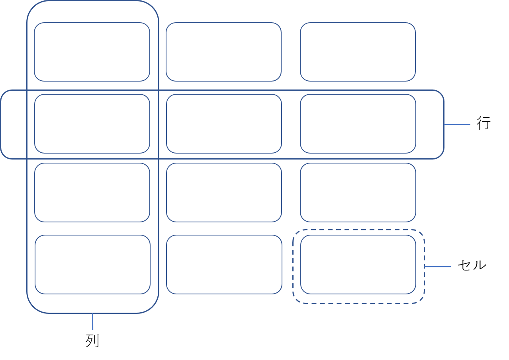

# テーブル
この節では、テーブルを表すテーブル関連の要素を説明します。

## 単純なテーブル

テーブル関連要素の説明に入る前に、テーブルの構成部品の整理を行います。テーブルの1つの項目をセル、テーブルを水平方向に切ったときのまとまりを行、垂直方向に切ったときのまとまりを列と呼びます。



図 3-8-01　テーブルの構成部品

これに対してHTMLのテーブルは、テーブルの範囲を`table`要素で、テーブルの中の行を`tr`要素で表し、行の中のセルを`td`要素で表します。

図 3-8-01の半分の行になりますが、2行3列のテーブルを考えてみると、次のようにマークアップできます。

```
<table>
  <tr>
    <td>日本</td>
    <td>東京</td>
    <td>アジア</td>
  </tr>
  <tr>
    <td>フランス</td>
    <td>パリ</td>
    <td>ヨーロッパ</td>
  </tr>
</table>
```

### テーブルに関する注意事項

テーブルは、レイアウトのために用いてはなりません。複雑なレイアウトに対しては、CSS FlexboxやCSS Gridなどのスタイルシートを用いることで解決するでしょう。

やむを得ずテーブルでレイアウトを表現する場合、` role="presentation"`を付与することで、明示的にレイアウトのためにテーブルを使用していることを支援技術に伝えることができます。
<!--テーブルレイアウトとは何なのか、というのは整理した方がいいかも？ -->

古いHTML仕様では、テーブルの要約を表すために、`table`要素に`summary`属性を加えて、属性値にその概要を書くことがありました。しかし、今日のHTML仕様ではこの属性は廃止されました。同等の内容を表す場合は、地の文などに記載します。

また、古いHTML仕様では、テーブルの枠線の制御するために、`border`、`frame`、`rules`属性を指定することがありましたが、これらの属性は廃止されています。さらに、間隔の調整に`cellspacing`や`cellpadding`という属性もありましたが、これらについても廃止されています。見栄えの調整についてはCSSで行うという原則どおりです。


## テーブルの見出し

`th`要素はテーブルの見出しを表します。見出しに相当するものは、`td`要素に代えて`th`要素で記載します。

見出しの範囲を指定する、`scope`属性を指定することができます。`scope`属性は列挙属性です。`row`は行方向（水平方向）の見出しであることを、`col`は列方向（垂直方向）の見出しであることを表します。また、`rowgroup`や`colgroup`といった、行グループや列グループの見出しであることを示す値もあります（行グループと列グループについては後述します）。デフォルトではコンテキストに基づく`auto`です。

前述のテーブルのコード例に見出しを付けると、次のようになります。

```
<table>
  <tr>
    <th>国名</th>
    <th>首都</th>
    <th>五大州</th>
  </tr>
  <tr>
    <td>日本</td>
    <td>東京</td>
    <td>アジア</td>
  </tr>
  <tr>
    <td>フランス</td>
    <td>パリ</td>
    <td>ヨーロッパ</td>
  </tr>
</table>
```


## テーブルのタイトル

`caption`要素は`table`のタイトル（キャプション）を表します。`figure`要素の唯一の子孫が`table`である場合、`caption`要素ではなく、`figcaption`要素を用います。

前述のテーブルのコード例にキャプションを付けると、次のようになります。

```
<table>
  <caption>国の首都と所属する州</caption>
  <tr>
    <th>国名</th>
    <th>首都</th>
    <th>五大州</th>
  </tr>
  <tr>
    <td>日本</td>
    <td>東京</td>
    <td>アジア</td>
  </tr>
  <tr>
    <td>フランス</td>
    <td>パリ</td>
    <td>ヨーロッパ</td>
  </tr>
</table>
```

<!--テーブルのタイトルを表すといいつつ、仕様はテーブルの説明も一緒に表してるように思われ、これでいいのかという。-->

## テーブルの行グループ
テーブルの行方向のグループ化として、テーブルのヘッダー行を示す`thead`要素、テーブルの本体を構成する行を示す`tbody`要素、テーブルのフッターを示す`tfoot`要素が用意されています。

古いHTMLでは、実際に表示される順に反して`tbody`要素よりも前に記述するものと定義されてましたが、現在は、表示される順番の通り`tbody`よりも後に記述します。


前述のテーブルのコード例に行グループを追加すると、次のようになります。

```
<table>
  <caption>国の首都と所属する州</caption>
  <thead>
  <tr>
    <th>国名</th>
    <th>首都</th>
    <th>五大州</th>
  </tr>
  </thead>
  <tbody>
  <tr>
    <td>日本</td>
    <td>東京</td>
    <td>アジア</td>
  </tr>
  <tr>
    <td>フランス</td>
    <td>パリ</td>
    <td>ヨーロッパ</td>
  </tr>
  </tbody>
　<!-- tfoot要素を加えるなら、この位置になる -->
</table>
```

## テーブルの列グループ

`colgroup`および`col`要素は、列グループと列をそれぞれ表します。`tbody`と`tr`に対応するものと考えるとわかりやすいかもしれません。

`span`属性は、グループ化する列の数を表します。1～1000の整数を指定できます。

前述のテーブルのコード例に列グループを追加すると、次のようになります。

```
<table>
  <caption>国の首都と所属する州</caption>
  <colgroup>
    <col span="2" style="background-color: #ccc;">
  </colgroup>
  <colgroup>
  </colgroup>  
  <thead>
  <tr>
    <th>国名</th>
    <th>首都</th>
    <th>五大州</th>
  </tr>
  </thead>
  <tbody>
  <tr>
    <td>日本</td>
    <td>東京</td>
    <td>アジア</td>
  </tr>
  <tr>
    <td>フランス</td>
    <td>パリ</td>
    <td>ヨーロッパ</td>
  </tr>
  </tbody>
</table>
```